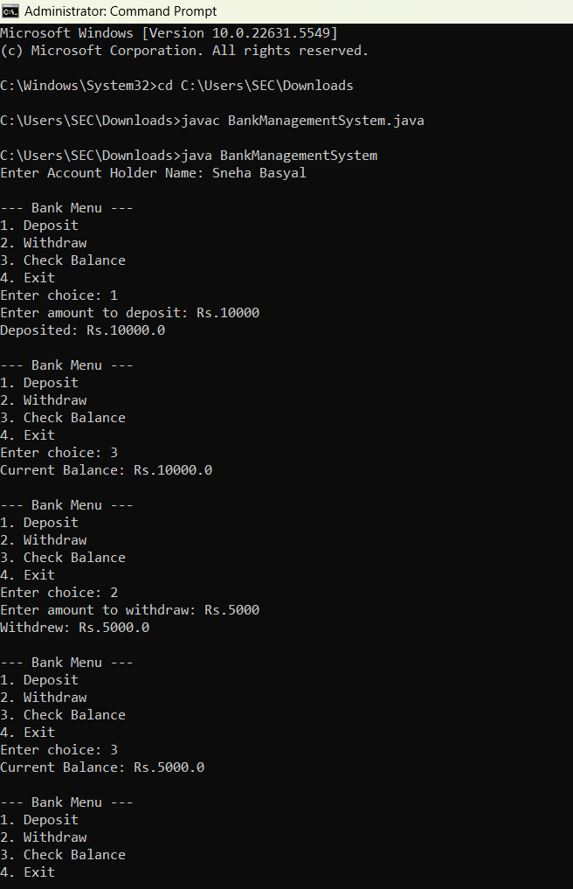
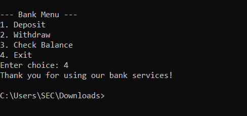

# Bank Management System 

## Introduction
This is a simple console-based **Bank Management System** written in Java.  
It allows the user to create an account, deposit money, withdraw money, and check balance.  
The project demonstrates my understanding of Java basics, OOP concepts, and input handling.

## Features
- Create an account
- Deposit money
- Withdraw money
- Check account balance

## Technologies Used
- Java JDK 17+
- Command Prompt / VS Code

## Program
```
import java.util.Scanner;

class BankAccount {
    private String accountHolder;
    private double balance;

    public BankAccount(String accountHolder) {
        this.accountHolder = accountHolder;
        this.balance = 0.0;
    }

    public void deposit(double amount) {
        if (amount > 0) {
            balance += amount;
            System.out.println("Deposited: Rs." + amount);
        } else {
            System.out.println("Invalid amount.");
        }
    }

    public void withdraw(double amount) {
        if (amount > 0 && amount <= balance) {
            balance -= amount;
            System.out.println("Withdrew: Rs." + amount);
        } else {
            System.out.println("Insufficient balance or invalid amount.");
        }
    }

    public void checkBalance() {
        System.out.println("Current Balance: Rs." + balance);
    }
}

public class BankManagementSystem {
    public static void main(String[] args) {
        Scanner sc = new Scanner(System.in);
        System.out.print("Enter Account Holder Name: ");
        String name = sc.nextLine();

        BankAccount account = new BankAccount(name);
        int choice;

        do {
            System.out.println("\n--- Bank Menu ---");
            System.out.println("1. Deposit");
            System.out.println("2. Withdraw");
            System.out.println("3. Check Balance");
            System.out.println("4. Exit");
            System.out.print("Enter choice: ");
            choice = sc.nextInt();

            switch (choice) {
                case 1:
                    System.out.print("Enter amount to deposit: Rs.");
                    account.deposit(sc.nextDouble());
                    break;
                case 2:
                    System.out.print("Enter amount to withdraw: Rs.");
                    account.withdraw(sc.nextDouble());
                    break;
                case 3:
                    account.checkBalance();
                    break;
                case 4:
                    System.out.println("Thank you for using our bank services!");
                    break;
                default:
                    System.out.println("Invalid choice.");
            }
        } while (choice != 4);

        sc.close();
    }
}
```
## Output Screenshots




## Gained Insights
- Learned the importance of matching Java class names with file names (case sensitivity).
- Improved understanding of object-oriented programming (OOP) concepts.
- Practiced handling user input and building interactive console programs.
- Understood how to compile and run Java code from both Command Prompt and VS Code.

## Author
Name: Sneha Basyal 
